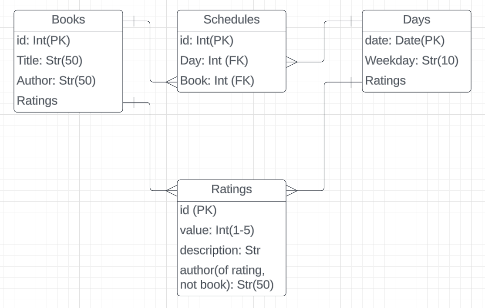

# Book Scheduler

## Demo

Short demo video on [Youtube.com](https://www.youtube.com/watch?v=hCGazdWA5xs)

## Project Pitch

A reading schedule app that combines unrealistic time expectations with wild planning fantasies.
Contains a global open source reading list for everyone to contribute to (and pretend to follow), a display to
show the schedule, a stock of books, and a list of all the days that people are planning to read what books.

---

## File Structure

```console
.
├── CONTRIBUTING.md
├── LICENSE.md
├── README.md
├── client
│   ├── README.md
│   ├── node_modules
│   ├── package-lock.json
│   ├── package.json
│   ├── public
│   └── src
└── server
    ├── app.py
    ├── config.py
    ├── migrations
    ├── models.py
    └── seed.py
```

---

## ERD



## User Stories

as a user, I want:
 - there to be a calendar where i can select a day to see what books are scheduled that day
 - a list of all the currently available books/unavailable books
 - search functionality for the list
 - a list of ratings for days
 - a list of ratings for books
 - options to see ratings for an individual day or book
 - a form to add in a new book
 - a form to add a rating to a day or book
 - a button to reserve a book for an amount of time
 - a nav bar
 - a home page for information about the app and authors

---

## Setup

### `server/`

To download the dependencies for the backend server, run:

```console
pipenv install
pipenv shell
```

Run the Flask API on [`localhost:5555`](http://localhost:5555) by
running:

```console
python server/app.py
```

---

### `client/`

To download the dependencies for the frontend client, run:

```console
npm install --prefix client
```

Run the React app on [`localhost:4000`](http://localhost:4000) by
running:

```console
npm start --prefix client
```

---

## Routes

standard API structure, with post and get requests going to "/[resourcename]", 
patches and deletes going to "/[resourcename]/[id]"

---

## Models

Refer to the ERD for relationships, validations are relatively extensive and prevent most misfire
API calls.

## Resources

- [Setting up a respository - Atlassian](https://www.atlassian.com/git/tutorials/setting-up-a-repository)
- [Create a repo- GitHub Docs](https://docs.github.com/en/get-started/quickstart/create-a-repo)
- [Markdown Cheat Sheet](https://www.markdownguide.org/cheat-sheet/)
- [Python Circular Imports - StackAbuse](https://stackabuse.com/python-circular-imports/)
- [Flask-CORS](https://flask-cors.readthedocs.io/en/latest/)
